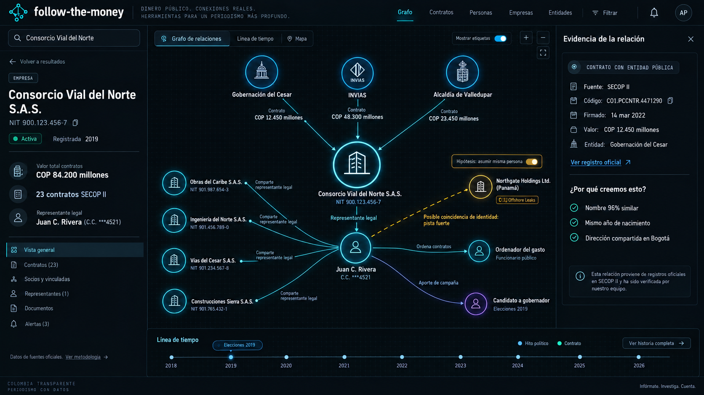

# Design: follow-the-money — Arkham-style investigation graph for Colombian public money

Generated by /office-hours on 2026-09-25
Branch: master
Repo: follow-the-money (local, open-source monorepo planned)
Status: APPROVED
Mode: Builder

## Problem Statement

Corruption in Colombia is documented in public records, but the records are scattered across SECOP II, RUES, Cuentas Claras, officials' declarations, and international datasets that nobody joins. Journalists and activists who want to know "who is who, who runs what, who is behind what and how are they connected" have to spend days stitching CSVs and portals together by hand.

follow-the-money is a public, open-source website: search a name, NIT, or cédula → land on an entity page → navigate a relationship graph of contracts, companies, legal representatives, approving officials, campaign donations, and international links. It borrows wallet-tracing UX from crypto research (Arkham) and goes further: cross-dataset leads that are probabilistic, explained, and verifiable.

Audience: investigative journalists and anti-corruption activists, Colombia first.

## What Makes This Cool

- **Colombian public data already carries the "wallet addresses."** SECOP II contract rows include the contractor's document number, the legal representative's ID, the *ordenador del gasto*'s cédula, and the supervisor's cédula. RUES carries the legal rep ID. Joins that are fuzzy guesswork in most countries are validated key joins here.
- **Hypothesis mode.** Name-only matches (e.g. ICIJ Offshore Leaks) appear as graded leads with reasons. A viewer toggles "asumir misma persona," the graph lights up with everything that follows, and a persistent banner lists every assumption in play. Toggle it off and it's gone. A guess never silently becomes a published fact.
- **Every edge opens its evidence.** Click any line → the source record(s), date, and a link labeled for what the source actually is (official registry, leak database, document page).

## Constraints

- Public hosted site; self-host (public-data stack only) later from the same code.
- Open-source monorepo. Colombia first; other countries later as adapters.
- Legal exposure is real: Colombian defamation claims, and habeas data under Ley 1581/2012 (data-subject rights to access, rectify, and delete; reclamos answered within 15 business days).
- Data licenses differ per source (see Licensing).
- DIAN's beneficial-owner registry (RUB) is not public. RUES open data has no shareholders and is a **current snapshot**.

## Premises (agreed)

1. **Don't rebuild Aleph.** A public, pre-loaded site where the mental map and the UX are the product. FollowTheMoney (FtM) is the data model (interop with OpenAleph, OpenSanctions, Gephi, Neo4j).
2. **Source classes are pluggable adapters:** (a) ID-keyed registries: SECOP II, RUES, Cuentas Claras, Función Pública PEPs, OFAC SDN (Colombian entries), GLEIF; (b) name-only structured data: ICIJ Offshore Leaks in v1, with UK PSC, debarment lists, and Wikidata later; (c) unstructured document dumps: future direction.
3. **Identity is a separate layer from facts** (revised after the Codex challenge). Sourced assertions are stored apart from identity judgments. Leads are graded **strong / moderate / weak with listed reasons**, never shown as a percentage until calibrated.
4. **Every edge cites its source record(s).**
5. **Leads, not verdicts.** Every identity link is one of three visibly distinct classes: **exact-ID** (validated ID join), **confirmado por revisión editorial** (a moderator-promoted judgment backed by an identity-establishing document), or **pista, requiere verificación** (everything else). Only the second class may use the word "confirmado". A correction flow exists from the first public day. No "corrupt" labels.
6. **Cédulas of natural persons, and natural-person NITs, are masked everywhere** (tightened during spec review from "private citizens only"; see Privacy rules).
7. **Licensing:** primary sources first; each source's redistribution terms are honored per output channel.

## Landscape (verified 2026-09-25)

| Source | Size / facts | Join key |
|---|---|---|
| SECOP II Contratos (datos.gov.co `jbjy-vk9h`, Socrata) | 6,070,870 contracts; contractor doc, legal rep ID *at signing*, ordenador del gasto cédula, supervisor cédula, `URLProceso`, signing date | NIT / cédula |
| RUES (datos.gov.co `c82u-588k`) | 9,407,309 merchants/companies; NIT, dates, status, *current* legal rep ID | NIT / cédula |
| Cuentas Claras (CNE) | Campaign donors 2015–2026, open formats | ID coverage to verify |
| Función Pública PEPs (OpenSanctions `co_funcion_publica`) | 18,682 persons with national ID, 6,795 positions | cédula |
| OFAC SDN | 437 Colombia-linked entities, 420 with cédula/NIT | cédula / NIT |
| GLEIF | 1,133 Colombian LEIs; `registeredAs` = NIT; foreign parents | NIT |
| ICIJ Offshore Leaks | Offshore entities, officers, intermediaries, addresses | name only → candidates |

Prior art: OCCRP ended open-source Aleph maintenance in Dec 2025 (Aleph Pro is closed; OpenAleph is the DARC fork). Transparencia por Colombia's Monitor Ciudadano cross-matched donors to contracts for 2018–2022 as CSV (24k rows) with no graph, search, or API. PACO publishes contractor red flags. Nobody offers a public graph investigation experience over this data.

## Cross-Model Perspective (Codex cold read)

- **Coolest version:** a living investigation you can branch, challenge, and replay: hypothesis branching, time travel, watched investigations, exportable evidence trails that include the unresolved assumptions.
- **Key insight:** Codex picked out the user's own line, "that's where things can get interesting. that's where patterns emerge", as the tell. Its own take was that the excitement lies in crossing between disconnected datasets, and that the breakthrough is helping researchers choose their next verification step.
- **Reuse:** FtM + nomenklatura (same/different/undecided judgments) as the foundation; yente later; Cytoscape.js first, Sigma.js benchmark later; Postgres before any graph DB; Splink only later.
- **Challenged premise #3** (a single confidence number per edge) → accepted and revised.
- **Weekend suggestion** (a SECOP-only shared-legal-representative explorer): adopted as M1's *scope*, built on Approach B's statement/identity model. We keep one name-only source (ICIJ) inside v1 at M3, because cross-dataset discovery is the core motivation.

## Approaches Considered

- **A: SECOP Rep Explorer on plain relationship tables.** Rejected *for its data model only*: hypothesis mode would force a rewrite. Its user-facing scope lives on as M1.
- **C: OpenAleph backend + custom front-end.** Rejected: heavy Elasticsearch/worker ops for a public site, cross-referencing that isn't hypothesis-aware, and coupling to a small-org fork. Revisit only as a document-extraction backend if document dumps are ever taken on.

## Recommended Approach: B, FtM statement engine + hypothesis UX (staged)

**v1 = M1 + M2 + M3.** M4+ are future directions outside this approval.

### Data model

- Every adapter emits **FtM statements**: `(entity_ref, schema, prop, value, dataset, source_record_id, source_url, valid_from, valid_to, observed_at)`. Only the properties the product uses are ingested (~20 per SECOP contract, not all ~90 columns).
- **Time semantics.** `valid_from/valid_to` come from the source when it has real dates (SECOP signing date → "rep at signing"). `observed_at` is the ingestion cutoff. Snapshot sources (RUES) produce relationships labeled **"vigente a <fecha de corte>"** and are never back-dated. The M1 hop "legal rep → other contractors" uses **SECOP's rep-at-signing**, so a 2018 contract is never joined through a 2026 RUES rep. RUES's current rep is shown as a separate, labeled edge.
- **ID validation before any exact-ID join:**
  1. Placeholder blocklist (`0`, repeated digits, `999999999`, "No Definido", "N/A", etc.).
  2. NIT check-digit validation (DIAN modulo-11), with NITs normalized with and without the check digit.
  3. Document-type consistency: a **legal-entity NIT never joins a cédula**. A **natural-person NIT** whose base equals a cédula and whose check digit validates *may* join that cédula when the person-type signals agree (RUES `organizacion_juridica` = persona natural, and/or SECOP `TipoDocProveedor`), because SECOP records the same natural-person contractor as either CC or NIT.
  4. Suspect-ID detection. An ID is downgraded to *candidate* and queued for review only when it looks like a data-entry error: it equals a known agency or contracting-entity NIT, or the names attached to it disagree across records (similarity below the weak threshold). **Genuinely prolific individuals** (many companies or contracts under one ID with consistent names) keep their exact edges and get a visible **"hub"** flag instead, since that's the pattern M1 exists to show. The review queue size is measured on the M1 cohort. Service level: moderator review within 10 business days; until then the edge is shown as a lead.
  5. Exact-ID matches to **OFAC or PEP** entries also require name agreement; without it they stay a lead (see the ID-based grade rows).
- **Identity layer** (nomenklatura-style). Judgments `positive | negative | unsure` with `origin: exact_id | matcher | reviewer`, `reasons[]`, `grade`, `author`, `timestamp`, `evidence_refs[]`.
- **Canonical graph = sourced statements + validated exact-ID judgments + editorially promoted judgments** (the third class is stored and rendered with its own label, see Premise 5). Matcher candidates and unpromoted reviewer judgments never enter it.
- **Stable IDs.** Each cluster gets an opaque random ID (ULID), **never derived from a cédula/NIT** (a hash of a 10-digit cédula is brute-forceable). Merges keep one ID and redirect the others (redirect table). Splits: the largest fragment keeps the ID, the others get new IDs, and the old URL shows "esta entidad fue dividida" with a chooser.

### Hypotheses vs judgments (two tiers)

| Tier | Created by | Stored | Visible to |
|---|---|---|---|
| **Viewer hypothesis** | Anyone, via the "asumir misma persona" toggle on a lead | URL only (opaque candidate IDs; no server state) | Whoever holds the link |
| **Reviewer judgment** | Registered researcher: "coincide / no coincide" + evidence note | Postgres, attributable, audit-logged | Private to the researcher until they publish it. Once published, shown on the lead as "2 revisores la consideran coincidente; sigue siendo pista" (never "confirmada"), and never as a solid canonical edge |

- **Reviewer identity in public.** Published judgments show the reviewer's **organization or a pseudonym**. The real identity is visible only to moderators. This protects journalists from retaliation and avoids tipping off subjects. Covered by the M3 legal review.

- **Promotion to canonical** happens only when a moderator approves a reviewer-confirmed lead **and** the confirmation cites a document that establishes identity (e.g. a notarized document or a court record). It is shown with a distinct edge style, "confirmado por revisión editorial (<fecha>)", which is different from exact-ID. It is revertible with an audit trail.
- **Hypothesis banner.** Any view with active hypotheses shows a persistent, non-dismissable banner listing each assumption and its grade. Image downloads from that view embed the same list.
- **Exports in v1:** only the **PNG image download** of the current graph view (M1), with source attribution and, when applicable, the hypothesis list. CSV/FtM-JSON data exports are a future direction.
- **Overlay mechanism.** A query-time union-find over canonical cluster IDs plus the active hypothesis pairs. Limits: at most 5 active hypotheses and 2 hops of expansion from the focus entity. Target p95 ≤ 800 ms.

### Roles

| Role | Milestone | Can |
|---|---|---|
| Anonymous viewer | M1 | Search, browse, view evidence, use viewer hypotheses (M3), submit corrections |
| Registered researcher | M3 | Everything above + persisted confirm/reject judgments. Accounts are invite-based and vetted by a moderator (journalists and NGOs first) |
| Moderator | M1 (maintainer via admin CLI); web UI at M3 | Handle corrections, suppressions, hub-threshold reviews, promotions |

### Privacy rules

- **Masking.** Every natural person's cédula **and natural-person NIT** is shown as `***` + the last 4 digits in the UI, API, evidence drawer, statement values, image downloads, and URLs. Officials are identified by name + position + dates, which doesn't need the full number. Only **legal-entity** NITs are shown in full.
- **Person-type classification** (in order): RUES `organizacion_juridica`; SECOP `TipoDocProveedor` / `Tipo de Identificación Representante Legal`; FtM schema (Person vs Company) from the source. When unknown, treat as a natural person and mask.
- **Search by full cédula** is allowed (journalists often hold IDs from documents). It returns the entity with its ID masked. This only confirms what SECOP already publishes about that person, and it's rate-limited per IP.
- **Minimization.** From RUES, only entities reachable from the other sources are ingested (contractors, legal reps, donors, PEP-linked companies, and their reps). Not the full 9.4M registry. Each refresh runs a **reachability backfill**: IDs newly reachable from new SECOP/CNE records are fetched from RUES by NIT/ID (Socrata `$where` in batches), and RUES rows that are no longer reachable are deleted.
- **Automated tests.** No response body, URL, entity ID, or image download contains a natural person's full ID number, whether bare digits or NIT-formatted with dots, a hyphen, and a check digit (regex check over the fixture corpus plus a property test on the ID generator).

### Correction / habeas-data flow (live from the first public day)

- **Intake:** a "Solicitar corrección" link on every entity page → a form plus a dedicated email address. Each request gets a ticket ID.
- **Owner:** the maintainer (moderator role). **Response target:** within 15 business days, per Ley 1581.
- **Request types:** *consulta* (access: "what do you hold about me?") with a **10-business-day** target, and *reclamo* (rectify/suppress) with a **15-business-day** target, per Ley 1581.
- **Requester verification.** Access, rectification, and suppression require a signed request plus a copy of the requester's ID (or a power of attorney for a representative), handled out of band and never stored in the main database. An **unverified** requester can still get (a) an annotation or (d) a referral to the source agency.
- **Access response:** every statement, identity judgment, and lead linked to the person, including hidden and weak leads and reviewer judgments (with reviewers pseudonymized).
- **Outcomes:** (a) annotate the entity with the requester's statement; (b) hide or reject an identity judgment or lead; (c) suppress public display of a natural person; (d) refer the requester to the source agency when the underlying official record is wrong; (e) **deny, with a stated reason**.
- **Suppression criteria.** Records of a natural person's **public role** are not suppressed but can be annotated: contractor, legal rep of a contractor at signing, ordenador del gasto, supervisor, campaign donor, PEP, or sanctioned party. **Incidental persons** can be suppressed: reachable only through a RUES snapshot, with no public-role record. Leads about any person can always be hidden (b).
- **Suppressed rendering:** a "persona suprimida" placeholder node with no name or ID. Derived edges through it stay (so "shared legal rep" between two companies remains visible). Search by that person's name or cédula returns nothing. The suppression record is kept internally so re-ingestion doesn't bring the person back. Golden-case fixtures must use non-suppressed records.
- Each outcome is logged with its date. Affected pages show a neutral notice: "Parte de esta información fue anotada o limitada a solicitud del titular (Ley 1581 de 2012)."
- The flow, including the suppression criteria, is part of the M1 legal-review gate.

### Leads: visibility, grading, candidates

- **Default visibility.** Leads are **hidden by default**. The viewer turns on "Mostrar pistas" on an entity, which lists strong and moderate leads. A second toggle, **"Incluir pistas débiles"**, only available once "Mostrar pistas" is on, adds weak leads and shows a warning ("coincidencia solo por nombre; alta probabilidad de homónimo"). Any listed lead can then be toggled with "asumir misma persona." Leads are never included in search results or server-rendered, indexable HTML (lead views are `noindex`).
- **Name similarity function.** Normalization: ASCII-fold, lowercase, drop particles (de, del, la, las, los, y), split into given-name tokens and surname tokens (using the source's field structure when present, otherwise the Colombian convention: the last two tokens are surnames). Score: the mean Jaro-Winkler of the best one-to-one token alignment, computed separately for surnames and given names and weighted 0.6 / 0.4. A missing second surname on one side is not penalized, but the first surname must align at ≥ 0.9. The thresholds below are validated and tuned on the pre-M3 ICIJ sample run.
- **Grade rules (initial).** Corroborating attributes are birth year/month, address, a co-linked entity, and nationality *only when it comes from a field independent of the blocking key* (e.g. birth country). **Any attribute used for blocking never counts as corroboration.**

  | Basis | Condition | Grade | Reason shown |
  |---|---|---|---|
  | Name | similarity ≥ 0.92 + ≥ 2 corroborating attributes | strong | the listed attributes |
  | Name | similarity ≥ 0.92 + 1 corroborating attribute | moderate | the attribute |
  | Name | similarity ≥ 0.95, no corroboration | weak | "solo nombre" |
  | ID | OFAC/PEP exact ID, name disagrees | strong | "mismo número de identificación, nombre distinto" |
  | ID | suspect ID (agency NIT / inconsistent names), pending review | moderate | "identificador sospechoso, en revisión" |

  Anything below these rows is not stored.
- **Candidate generation.** Blocking on normalized first-surname + second-surname-or-first-given-name tokens, plus country. Every candidate in a block is scored and graded first, then ordered by grade, then corroboration count, then name similarity, and only then **truncated to 10 per source record**. Records that hit the cap are logged. Before M3, a sample run on ICIJ's Colombia-linked records measures volume, grade distribution, and the cap-hit rate.
- **Path ranking (reserved for the future path-search feature):** weakest-link grade, then the number of non-exact edges, then path length. There are no multiplied "probabilities."

### Evidence drawer by source class

| Source class | Link label |
|---|---|
| Colombian government registry (SECOP, RUES, CNE, Función Pública) | "Ver registro oficial ↗" |
| Foreign official list (OFAC, GLEIF) | "Ver en <fuente> ↗" |
| Leak database (ICIJ) | "Ver en ICIJ Offshore Leaks ↗ (filtración, no registro oficial)" |
| Derived edge (e.g. shared legal rep) | Lists **every** contributing record, each with its own link |
| Published reviewer judgment | Reviewer organization/pseudonym, date, and the cited evidence document |
| Editorial promotion | "Confirmado por revisión editorial", date, and the identity-establishing document |

### Group contractors (unión temporal / consorcio)

- Node type `ContractorGroup` (FtM Organization with a group flag).
- If member data is available (Open Question 2), group → member edges carry member IDs.
- If it isn't, the node shows **"miembros no disponibles en datos abiertos"** and still expands through its legal rep, ordenador del gasto, and contracts.

### Stack

- `apps/web`: React + TypeScript + Vite, Cytoscape.js.
- `apps/api`: FastAPI (Python, so it shares the FtM/nomenklatura libraries).
- `packages/ingest`: Python adapters (zavod-style), incremental refresh via Socrata `:updated_at`.
- `packages/resolver`: ID validation, judgments, candidate generation, grading.
- PostgreSQL: statements (partitioned by dataset), judgments, redirects, and materialized entity/edge tables refreshed incrementally for changed source records only; `pg_trgm` for search. No graph DB until measured need.

### Sizing (estimate, to be re-measured on the M1 cohort before widening)

- SECOP II: 6.07M contracts × ~20 ingested props ≈ **120M statements**.
- Minimized RUES: ~0.5–1M entities × ~12 props ≈ **6–12M statements**.
- M2 sources: < 5M statements.
- Total ≈ 130–140M statements, roughly 60–120 GB including indexes. That's one managed Postgres instance; refreshes are incremental.
- Go/no-go: extrapolate from the M1 cohort's measured bytes per statement.

### Visual direction

Variant B, "Arkham terminal" (approved).

Kept for reference: [variant A, newsroom dark](assets/follow-the-money-mockup-variant-A.png) · [variant C, paper evidence board](assets/follow-the-money-mockup-variant-C.png).

- **In M1:** search, entity card with NIT under every company node, relationship graph, evidence drawer, correction link.
- **Deferred:** hypothesis toggle chip + "¿Por qué creemos esto?" (M3); timeline scrubber (future); alerts (future).
- **Required fixes to the mockup:** a lead must never say "verificada"; use neutral icons, not official crests.
- **Guardrail against a "sensational" read:** neon only on the graph; typography and evidence panels stay sober.

### Milestones and gates

- **M1: SECOP II + RUES explorer.** The first ingest cohort is **derived from the golden-case trace** (every record in the trace, plus the agency's contracts for the same two years). Search (name/NIT/cédula with disambiguation) → entity page → expand contractor → legal rep (at signing) → other contractors → contracts/agencies → ordenador del gasto. Evidence drawer, shareable URLs, masking, correction flow. Deployed to a **private staging URL** during development. Once the cohort works, ingest is **widened to all of SECOP II plus reachable RUES** before launch.
  - **Public launch gate (end of M1):** national SECOP II + reachable RUES coverage is live; a Colombian press-freedom lawyer (e.g. FLIP) reviews masking, wording, the correction flow, and the suppression criteria; and the Sunday test passes. For the Sunday test, someone other than the tester picks a contractor from the ingested data that is known to have a documented shared legal representative.
- **M2: remaining ID-keyed sources.** Cuentas Claras, Función Pública PEPs, OFAC SDN, GLEIF.
  - *Exit:* every source passes ID validation with a reviewed hub report, and the golden case gains at least one cross-source hop (e.g. rep → donation → candidate) with evidence.
- **M3: ICIJ leads + hypothesis mode + researcher accounts.**
  - *Gate:* a second legal review, covering lead display, reviewer-annotation wording, and public reviewer identity (organization/pseudonym), before M3 features go public.
- **Future directions (not approved here):** path search ("¿cómo se conectan A y B?", using the path-ranking rule above); CSV/FtM-JSON data exports; a timeline scrubber (limited to relationships with real historical dates, with the limit stated in the UI); watched investigations and change reports; UK PSC, debarment lists, and Wikidata; a private-data self-host mode; document dumps (only where they connect to Colombian public money, e.g. Colombian court records).

## Licensing

| Source | License / terms | API + public site | Image downloads (v1's only export) | Self-host bundle |
|---|---|---|---|---|
| SECOP II, RUES, Cuentas Claras (datos.gov.co / CNE) | Colombian open data; verify the per-dataset license | Yes, with attribution | Yes, with attribution | Yes |
| OFAC SDN | US public domain | Yes | Yes | Yes |
| GLEIF | CC0 | Yes | Yes | Yes |
| Función Pública PEPs via OpenSanctions | CC BY-NC 4.0 | Yes (nonprofit public instance), attributed | Non-commercial notice attached | **Excluded**; the operator fetches it under their own license (or scrapes the primary source) |
| ICIJ Offshore Leaks | ODbL (+ CC BY-SA for content) | Yes, attributed | ICIJ-derived data carries the ODbL share-alike notice | Yes, with the ODbL notice |

- **Code license: MIT** (chosen by the user during review). Code is maximally reusable; hosted forks are not required to publish modifications. Data licenses are separate and documented in `DATA_LICENSES.md`. Data files are never committed to the repo, so NC/ODbL terms never attach to the code.

## Open Questions

1. **Cuentas Claras ID coverage:** do donor records carry cédula/NIT consistently?
2. **SECOP group membership:** which dataset lists unión temporal / consorcio members, and does it carry member IDs? (The golden-case hand trace should answer this.)
3. **Naming:** `followthemoney` is already the PyPI/GitHub name of the FtM library this depends on. Pick a distinct repo/package name.
4. **Hosting and abuse:** hosting budget; rate limits; a policy for handling pressure or takedown requests.
5. **Florida Sunbiz / Panama registry:** bulk availability, for a future adapter.
6. **Calibration:** the size of the labeled set of reviewer judgments needed before grades can become honest probabilities.
7. **datos.gov.co license** per dataset (confirm the attribution / share-alike terms).

## Success Criteria

- **M1 Sunday test:** a journalist given an unfamiliar contractor finds a documented shared legal representative and opens the supporting SECOP record **within 2 minutes**.
- The golden case is reproduced by the tool, with every edge citing its source record(s).
- The privacy test suite passes: no full natural-person ID (cédula or natural-person NIT, in any formatting) appears in any response, URL, entity ID, or image download.
- **M2 exit criteria** as listed above.
- **M3 drawer usability:** in 3 of 3 journalist sessions, a verify-or-reject decision is reached from the evidence drawer alone.
- **M3 discovery value:** on a reviewed sample of 30 strong leads, ≥ 50% are confirmed true, and at least one confirmed lead did not appear in a news-archive search (Google News + El Tiempo, El Espectador, La Silla Vacía, Cuestión Pública) at the time of review. **"Confirmed" means the promotion standard:** a cited identity-establishing document, checked by the moderator **and** one external journalist. If fewer than 30 strong leads exist, all of them are reviewed (minimum 10). With fewer than 10, the result is reported as inconclusive and the grade thresholds are revisited.

## Distribution Plan

- Public web service (single hosted instance). GitHub Actions deploys from `main` to staging. Production is promoted manually after the M1 launch gate. Ingest jobs run on a schedule.
- Public GitHub monorepo, MIT, with `DATA_LICENSES.md`.
- A self-host docker-compose (public-data stack only, OpenSanctions-derived data excluded) after M2.

## Next Steps

1. Do the Assignment (the hand trace). It defines the golden fixture and the first cohort, and answers Open Question 2.
2. Scaffold the monorepo (`apps/web`, `apps/api`, `packages/ingest`, `packages/resolver`) with Postgres in docker-compose.
3. Build the SECOP II adapter for the trace-derived cohort: FtM statements with source IDs/URLs and validity dates, plus ID validation.
4. Build the RUES adapter, limited to reachable NITs/IDs; add opaque IDs and the redirect table.
5. Add API endpoints `/search`, `/entity/:id`, `/entity/:id/expand`, and `/edge/:id/evidence`, plus the privacy test suite.
6. Build the variant-B M1 UI, the correction flow, and the PNG download; deploy to staging.
7. Measure bytes per statement on the cohort and extrapolate the sizing, then widen to all of SECOP II + reachable RUES (with the reachability backfill).
8. Run the Sunday test and legal review on the widened data, then do the public launch, then start M2.

## The Assignment

Before writing any code: pick one already-reported Colombian contracting case and **trace it by hand** through the SECOP II and RUES APIs using only contractor and legal-rep ID numbers. Centros Poblados is a good candidate; if its unión temporal members can't be reached from open data, pick a case with a single-company contractor. Write down every hop (dataset, field, value → next hop, and the date of each record). That file becomes M1's golden test fixture and defines the first ingest cohort. Then show the hand-drawn graph to one Colombian investigative journalist and ask: "what's the next hop you'd want to click?"

## What I noticed about how you think

- You named the lens immediately: "As crypto researcher I am used to follow the wallets, I want to go beyond that." That framing produced the key insight of the session. Colombian IDs *are* the wallet addresses.
- When I pushed name-only matches into a safe corner, you pushed back: "that is where things can get interesting... that's where patterns emerge." The whole hypothesis-mode design came from that pushback.
- You drew the line between leads and verdicts yourself: "not legally binding but the idea here is to reduce the investigation time and uncover hidden facts that need to be verified."
- "The mental map and the UX are the product." You then chose the boldest visual direction, which fits that conviction.

<!-- gstack:office-hours:concerns:start -->
## Reviewer Concerns

Disposition: CONCERNS_RECORDED

Stop: MAX_ITERATIONS

### R3-1 — consistency

**Problem**

> Leads are created before any lead UI exists. Suspect-ID edges arise in M1 ('until then the edge is shown as a lead'), and OFAC/PEP exact-ID matches with name disagreement arise in M2 ('stay a strong lead'). But 'Mostrar pistas', the hypothesis chip and 'asumir misma persona' are deferred to M3 (Visual direction; Roles: 'use viewer hypotheses (M3)'), and the lead-display legal review is the M3 gate. The document does not say how an M1 or M2 viewer sees these edges, or whether they are hidden entirely until M3. A suspect legal-rep ID in the M1 core hop would silently drop out of the graph.

**Remedy**

> State the pre-M3 behavior. Either ID-based leads are hidden entirely until M3, with a neutral 'vínculo en revisión' marker on the affected node, or a minimal 'Mostrar pistas' for ID-based leads ships in M1/M2 and its wording is covered by the M1 legal review.

### R3-2 — feasibility

**Problem**

> ID validation rule 4 downgrades an ID to a suspect candidate when 'it equals a known agency or contracting-entity NIT'. In SECOP, public entities are routinely contractors of other public entities (convenios/contratos interadministrativos, such as universities or public companies), so legitimate contractor NITs would be flagged as suspect. This floods the single-moderator queue and hides real edges as leads.

**Remedy**

> Flag an agency NIT only when it appears where it cannot legitimately be: as the contractor on its own contract (contractor NIT equals the contracting entity), or in a natural-person field (legal rep, ordenador, supervisor). Treat public-entity contractors as normal exact edges.

### R3-3 — clarity

**Problem**

> Rule 4 defines name disagreement as 'similarity below the weak threshold'. The only weak threshold in the grade table is ≥ 0.95, which is stricter than the strong threshold of 0.92. Read literally, any ID whose attached names score below 0.95 (ordinary typos, abbreviations, or a reordered name across SECOP records) is flagged suspect. That differs sharply from a reading of 'below 0.92'.

**Remedy**

> Give an explicit numeric cutoff for ID name disagreement, separate from the lead grades (for example a lower bound such as < 0.80 on the surname component). Validate it on the M1 cohort.

### R3-4 — consistency

**Problem**

> The hub-threshold mechanism was replaced (prolific IDs now keep exact edges with a 'hub' flag, and only suspect IDs are reviewed). The Roles table still lists 'hub-threshold reviews' as a moderator duty, and the M2 exit still requires 'a reviewed hub report'. These no longer match rule 4.

**Remedy**

> Rename these to 'suspect-ID reviews' and 'a reviewed suspect-ID report' (plus a hub-flag report if that is wanted), so the duties and exit criteria match rule 4.

### R3-5 — clarity

**Problem**

> The criterion for the visible 'hub' flag is no longer stated. The earlier '> 50 entities' threshold was removed, and rule 4 says only 'many companies or contracts under one ID', so engineering cannot implement the flag and reviewers cannot predict which people carry a publicly visible label.

**Remedy**

> Define the hub-flag rule (for example, legal rep of ≥ N companies or party to ≥ M contracts, measured on the M1 cohort) and its UI wording, and have the M1 legal review check that the wording is neutral.

### R3-6 — feasibility

**Problem**

> ICIJ stores officer names as a single free-text string, often reordered ('SURNAME, GIVEN') or with one surname. The fallback 'last two tokens are surnames' misparses these: 'JUAN CARLOS PEREZ' yields surnames 'CARLOS PEREZ'. The rule 'a missing second surname is not penalized' cannot apply, because the parser cannot know a surname is missing. It also breaks the 'first surname must align ≥ 0.9' check.

**Remedy**

> When field structure is absent, score several parses (one and two surnames, given-first and surname-first, comma-delimited) and keep the best-scoring parse, recording which parse was used in the lead's reasons. Measure parse ambiguity in the pre-M3 sample run.

### R3-7 — feasibility

**Problem**

> Each record gets one blocking key, 'first-surname + second-surname-or-first-given-name', and that key needs exact normalized token equality. A record with two surnames and its one-surname counterpart get different keys, so they are never compared. Spelling variants of the first surname never share a block either, so the similarity function's tolerance (≥ 0.9 Jaro-Winkler on the first surname, no penalty for a missing second surname) never applies.

**Remedy**

> Emit several blocking keys per record: first surname + second surname, first surname + first given name, and a phonetic or prefix key on the first surname. Deduplicate the candidate pairs before scoring, and report the recall effect in the sample run.

### R3-8 — feasibility

**Problem**

> Blocking includes 'country', and the sample run is on 'ICIJ's Colombia-linked records'. Colombians in offshore leaks often appear only with a Panama, Miami, BVI or Spain address or jurisdiction. Requiring a Colombia country match drops exactly the cross-border cases that motivate M3.

**Remedy**

> Define which ICIJ country fields make a record eligible (for example any linked country, or address country, or the country of an intermediary or entity). Or drop country from the block key and use it only as a filter in the sample run to measure what is lost.

### R3-9 — clarity

**Problem**

> 'A co-linked entity' is a corroborating attribute, but the document does not define how two records are co-linked when ICIJ and the Colombian sources share no IDs. If this is itself a name match (an ICIJ company name resembling a RUES company), a name-only inference would be counted as independent corroboration.

**Remedy**

> Define co-linked entity precisely: which entity pairs count, and what match standard applies (for example an exact-ID link through GLEIF, or a legal-entity name match above a stated threshold). State whether an unverified name match can count as corroboration.

### R3-10 — completeness

**Problem**

> An unverified requester can still obtain outcome (a), 'annotate the entity with the requester's statement'. The public notice then says the information was annotated 'a solicitud del titular'. Anyone can therefore attach text to a person's or company's page and present it as the data subject's own statement. This is an impersonation and defamation vector, and it undercuts the verification rule added for R2-4.

**Remedy**

> Restrict (a) to verified requesters, or label unverified annotations as 'declaración de un tercero no verificado' with moderator review of the content. Use the 'a solicitud del titular' notice only for verified requests.

### R3-11 — consistency

**Problem**

> The correction flow states a single 'Response target: within 15 business days, per Ley 1581' on the Owner line. The next bullet sets 10 business days for consultas. The blanket 15-day statement contradicts the access deadline.

**Remedy**

> Change the Owner line to point to the per-type targets (consulta 10, reclamo 15 business days), or remove it.

### R3-12 — completeness

**Problem**

> Requester verification collects signed requests and copies of identity documents 'handled out of band and never stored in the main database'. The document does not say where these sensitive documents are kept, who can access them, or how long they are retained, even though the project is itself a Ley 1581 data controller for them.

**Remedy**

> Specify the storage location (for example an encrypted mailbox or vault), access (moderator only), a retention period tied to ticket closure plus the legal hold, and deletion. Include this in the M1 legal review.

### R3-13 — feasibility

**Problem**

> One maintainer is the moderator for legally binding habeas-data deadlines (10 and 15 business days), the suspect-ID queue with a 10-business-day SLA, promotions, and researcher vetting. The suspect-ID queue size is measured only on the M1 cohort, but public launch happens after widening to national SECOP II plus RUES. There is no backup owner, and the queue is not re-measured at national scale before the launch gate.

**Remedy**

> Re-measure the suspect-ID queue on the widened national data before the launch gate. Name a backup moderator, or define an escalation path for the legal deadlines. State that the suspect-ID SLA is best-effort (edges stay leads) while the Ley 1581 deadlines take priority.

### R3-14 — feasibility

**Problem**

> The M3 discovery metric counts a lead as 'confirmed' only under the promotion standard: an identity-establishing document such as a notarized document or court record, checked by the moderator and one external journalist. For ICIJ offshore officers such documents are rarely obtainable, so most true leads would stay unresolved. They would count against the '≥ 50% confirmed true' target. The metric would then measure how documentable a lead is rather than how precise the grades are, and it has no refuted or unresolved category.

**Remedy**

> Classify each reviewed lead as confirmed, refuted, or unresolved. Compute precision over resolved leads, with a minimum number resolved, and report the unresolved share separately. Alternatively, define a lower but still explicit evidence standard for the metric than for public promotion.

### R3-15 — completeness

**Problem**

> ICIJ data is ODbL. The ICIJ-derived leads, grades and reviewer judgments are a Derivative Database that the public site uses publicly, and ODbL then requires offering that derivative database (or the means to recreate it) under ODbL. v1 ships no data export (PNG only), so the design has no way to meet the share-alike obligation. The Licensing table covers only notices.

**Remedy**

> Decide how the ICIJ-derived database is made available under ODbL: for example a periodic dump of the lead and grade tables with pseudonymized reviewer judgments, or published matching code plus parameters as the alteration file. Confirm the choice in the M3 legal review.

### R3-16 — feasibility

**Problem**

> Prolific individuals now keep all their exact edges with a hub flag. Expanding the M1 path contractor → legal rep → other contractors → contracts can therefore return thousands of nodes for one legal rep or agency. The document sets no per-expansion node cap, pagination, or aggregation, so neither the Cytoscape rendering nor the overlay's 'p95 ≤ 800 ms' over 2 hops is bounded.

**Remedy**

> Define the expansion limits: a maximum number of nodes per expand (for example 50), aggregation into 'N contratos más' or grouping by agency or year with drill-down, and the ordering used to pick which neighbors are shown first.
<!-- gstack:office-hours:concerns:end -->
